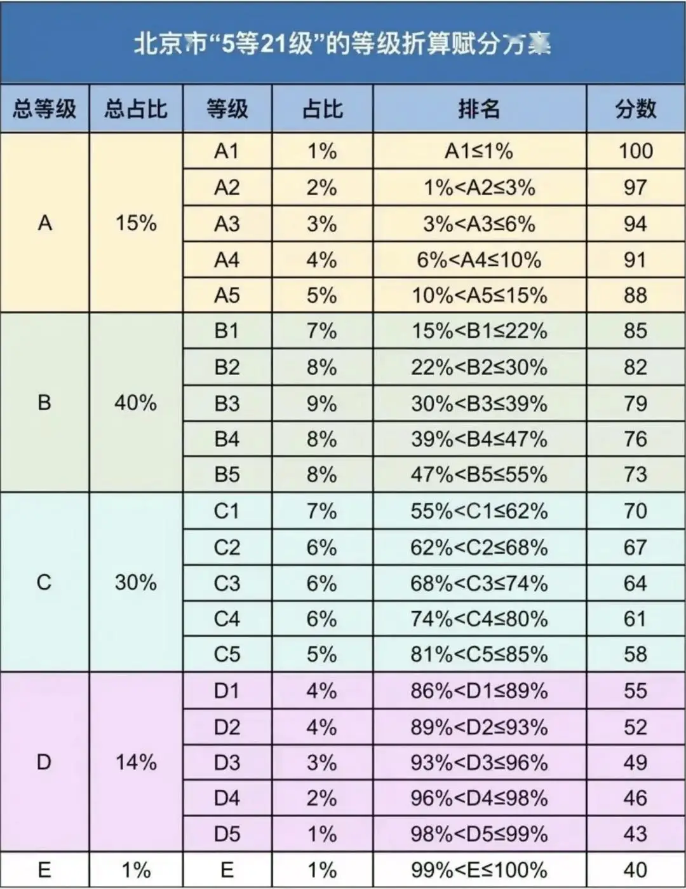

# 高考等级折算赋分程序

## 简介

`AssignScore.py` 是一个用于根据等级折算赋分方案计算学生成绩的 Python 脚本。

默认的等级折算赋分方案为北京市高考五等21级赋分表：



如需其他赋分方案，可修改等级折算赋分方案中的数据。

## 依赖

- pandas
- numpy
- openpyxl

## 用法

下载本仓库文件，并进入该目录：

1. 确保 [`等级折算赋分方案.xlsx`] 文件在当前目录下。
2. 准备一个无表头的 Excel 文件作为输入文件，包含两列数据：学生名和原始分数。
3. 运行以下命令：

```sh
python AssignScore.py <输入文件>
```

## 输出

脚本将生成一个名为 赋分后结果.xlsx 的 Excel 文件，包含以下列：

- 姓名
- 原始分数
- 排名
- 排名占比
- 等级
- 赋分

## 示例

```sh
python AssignScore.py students_scores.xlsx
```