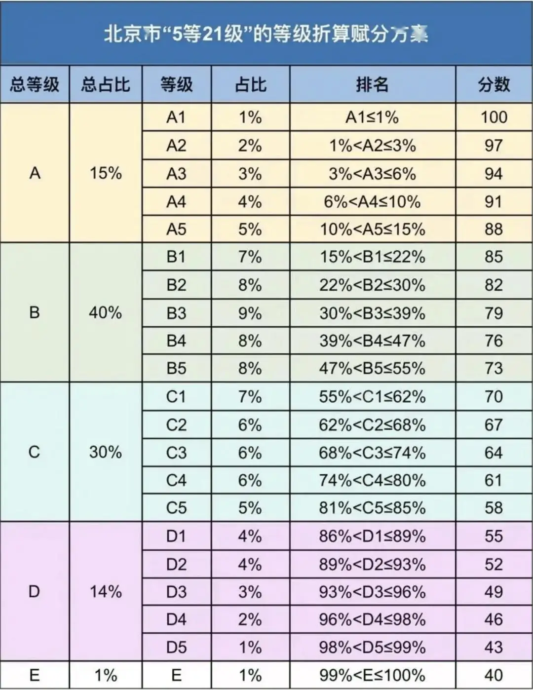

# 高考等级折算赋分程序

## 简介
`AssignScore.py` 是一个用于根据等级折算赋分方案计算学生成绩的 Python 脚本。  
`CompareScore.py` 新增了两次考试（如月考 VS 期中）年级/班级进退步分析功能，按各科及总分排名百分比变化筛选显著进步或退步学生。

默认的等级折算赋分方案为北京市高考五等21级赋分表：



如需其他赋分方案，可修改等级折算赋分方案中的数据。

## 依赖
- pandas
- numpy
- openpyxl

## 用法

### 1. 等级折算赋分 (`AssignScore.py`)
1. 确保 `等级折算赋分方案.xlsx` 文件在当前目录。
2. 准备一个无表头的 Excel 输入文件，包含两列：学生名、原始分数。
3. 运行：
```sh
python AssignScore.py <输入文件>
```
输出：生成 `赋分后结果.xlsx`，列包括：姓名 / 原始分数 / 排名 / 排名占比 / 等级 / 赋分。

示例：
```sh
python AssignScore.py students_scores.xlsx
```

### 2. 成绩进退步分析 (`CompareScore.py`)
用于比较两次考试的各科与总分年级排名，按百分比变化判定显著进步或退步（默认阈值 20%）。

支持两种模式：
- 单文件双 sheet：一个 Excel，两个 sheet 分别放两次考试
- 双文件：两个独立 Excel 文件

脚本内部默认的列名映射（可在代码中修改）：
- 上次考试总分排名列：`校排名.9`
- 本次考试总分排名列：`折算后排名`（若实际不一致可手动调整为期中表对应的总分排名列）
- 各科排名列示例：`校排名`, `校排名.1`, … `校排名.9`

可用参数：
- 单文件模式：
  - `--file <excel>` 指定文件
  - `--sheet-prev <名称>` 上次考试 sheet（默认：月考）
  - `--sheet-curr <名称>` 本次考试 sheet（默认：期中）
- 双文件模式：
  - `--file-prev <excel>` 上次考试文件
  - `--file-curr <excel>` 本次考试文件
  - 可同时用 `--sheet-prev / --sheet-curr` 指定各自 sheet
- 其它参数：
  - `--class <班级>` 只分析指定班（例如 6班），缺省分析全年级
  - `--threshold <浮点>` 进退步百分比阈值（默认 0.2 即 20%）
  - `--output <文件名>` 输出文件（默认：成绩进退步分析.xlsx）

输出文件包含：
- `全年级各科人数`：各科参与排名人数
- `全部班级全部学生百分比` 或 `X班全部学生百分比`：所有可对比学生的具体排名与百分比变化
- `全部班级进退步>20%` 或 `X班进退步>20%`：显著进步/退步学生筛选结果

示例（单文件双 sheet）：
```sh
python CompareScore.py --file 成绩汇总.xlsx --sheet-prev 月考 --sheet-curr 期中 --threshold 0.2
```

示例（双文件）：
```sh
python CompareScore.py --file-prev 月考.xlsx --file-curr 期中.xlsx --sheet-prev 月考 --sheet-curr 期中 --output 进退步.xlsx
```

只分析 1 班：
```sh
python CompareScore.py --file 成绩汇总.xlsx --class 1班
```

修改阈值为 25%：
```sh
python CompareScore.py --file-prev 月考.xlsx --file-curr 期中.xlsx --threshold 0.25
```

## 注意
- 若原始表中班级或姓名列显示为 `Unnamed: 0` / `Unnamed: 1`，脚本会自动重命名为 `班级` / `姓名`。
- 若总分排名列名称与默认不一致，请在 `CompareScore.py` 中调整 `prev_rank_cols` / `curr_rank_cols` 的映射。
- 百分比 = 排名 / 该科有效总人数；百分比下降视为进步。

## 许可
个人学习与教学辅助使用，禁止用于商业收费。
